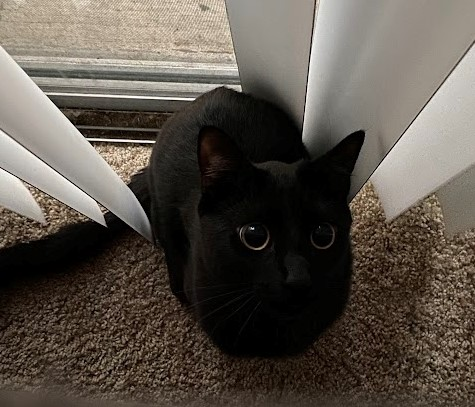

## Hi there!  
  

  
  

### Biography  
My name is Bryce Chapman and I am a biomedical engineering masters graduate from the University of Florida, currently looking for work in the United States as a biomedical/healthcare modeler. I have experience in using computational and theoretical modeling of biological and physical phenomena, from fluid mechanics to drug diffusion to explosions. 
  

   

## Current Projects on Github
- [[GitHub](https://github.com/brycon2/GastricDrugBioactivity), [Web App](https://brycon2-gastricdrugbioactivity-app-gn1jup.streamlitapp.com/)] Determining potential drug effectiveness for reducing stomach acidity using a k-nearest neighbor model and a  weighted decision tree. Computed using Google Colab in Python.
- [[GitHub](https://github.com/brycon2/PancreaticAdenocarcinomaGenetics), [HTML RMD File](https://brycon2.github.io/PancreaticAdenocarcinomaGenetics/)] Investigating how genes are regulated in pancreatic adenocarinoma tissue compared to normal healthy tissue. Completed in R. 
- [GitHub] Investigating the Lead-Crime relationship with NYCHealth data and NYPD Crime data from the early 2000's to 2019. Data carpentry and analysis all done in R. 
- [GitHub] Creating a dashboard to visualize Connecticut municipality warrant data by scraping publicly released documents in Python.  
  

   
* Note: Completed projects may still require some stylistic touch-ups but the work is done. 

## Languages and Tools  

  
  
  
  
  
  
  
  
  

  

   

## Fun Facts About Me  
<table><tr><td valign="top" width="50%">

- I have lived in Belgium, Costa Rica, Maryland, and Florida  
  

- I was the president of a student organization called [GRiP](https://www.bme.ufl.edu/labs/grip/), where I helped create and donate adaptive technology to children with disabilities.  

- I have a black cat named Bruce Wayne due to his propensity to pursue justice from the shadows.  

</td><td valign="top" width="50%">

</td></tr></table>
 
